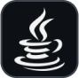

# Hello !

## Ask me about :

- Mobile Development: Questions about building mobile apps with Flutter, Kotlin, or Java.
- DevOps: Best practices for containerization with Docker, CI/CD pipelines, and Kubernetes cluster management.
- Backend Development: Creating scalable APIs and robust web applications using Symfony or Firebase.
- Cloud Solutions: Setting up cloud infrastructures, working with Firebase, or managing production environments.
- Tech Tools: Advice on using GitHub for version control, Docker for containers, and Figma for design collaboration.

## Development

    Discover my development skills, spanning from mobile technologies to DevOps tools,
    including work environments and web frameworks.
    Below is an overview of the tools and technologies I work with:

### Mobile Development :

|             **Flutter**             |            **Kotlin**             |           **Java**            |
|:-----------------------------------:|:---------------------------------:|:-----------------------------:|
|  |  |  |

    Building cross-platform mobile applications with Flutter while integrating native solutions using Kotlin and Java.

### Devops :

|             **Github**             |            **Docker**             |           **Kubernetes**            |
|:----------------------------------:|:---------------------------------:|:-----------------------------------:|
|  |  |  |

    Implementing CI/CD pipelines with GitHub, containerizing applications with Docker, and managing clusters using Kubernetes.

### Env :

|             **Firebase**              |            **Figma**            |
|:-------------------------------------:|:-------------------------------:|
|  |  |

    Managing cloud backends with Firebase and creating collaborative designs with Figma.

### Web :

|              **Symfony**              |
|:-------------------------------------:|
|    |

    Developing robust and scalable web backends using the Symfony framework.

## GitHub Statistics

 

<!--
**ymunsch8/ymunsch8** is a ✨ _special_ ✨ repository because its `README.md` (this file) appears on your GitHub profile.

Here are some ideas to get you started:

- 🔭 I’m currently working on ...
- 🌱 I’m currently learning ...
- 👯 I’m looking to collaborate on ...
- 🤔 I’m looking for help with ...
- 💬 Ask me about ...
- 📫 How to reach me: ...
- 😄 Pronouns: ...
- ⚡ Fun fact: ...
-->
