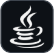

# Yohann Munsch

**Architecte logiciel, développeur d'applications**

## Curriculum Vitæ

- [CV en ligne](https://ymunsch8.github.io/CV/)
- [Télécharger le PDF](https://github.com/ymunsch8/CV/raw/main/CV.pdf)

## À propos

Architecte logiciel et développeur d'applications, titulaire du titre RNCP de niveau 7 (Epitech Nancy). Chez LapilleDev, j'ai conçu et maintenu des applications web et mobiles de bout en bout — API REST, bases MySQL et MongoDB, déploiement Docker/Kubernetes et pipelines CI/CD. J'allie rigueur technique, documentation claire et sens du produit.

## Compétences

### Principales

**Symfony** · **Flutter** · **Kubernetes**

### Backend & API

Express · Java · Symfony

| **Symfony** | **Java** |
|:-----------:|:--------:|
|  |  |

### Mobile

Android · Flutter · Java · Kotlin

| **Flutter** | **Kotlin** | **Java** |
|:-----------:|:----------:|:--------:|
|  |  |  |

### Frontend

CSS · HTML

### Bases de données

MongoDB · MySQL

### DevOps & infra

Apache · ArgoCD · CI/CD · Docker · Firebase · Kubernetes · Linux · Nginx

| **GitHub** | **Docker** | **Kubernetes** | **Firebase** |
|:----------:|:----------:|:--------------:|:------------:|
|  |  |  |  |

### Outils

Figma · Git · GitHub · Lens

| **Figma** |
|:---------:|
|  |

## Statistiques GitHub

## Disponibilité

Je recherche un poste de développeur confirmé en développement d'applications.
